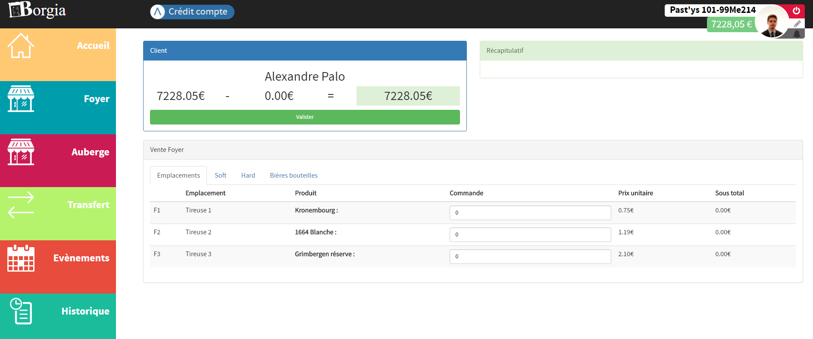
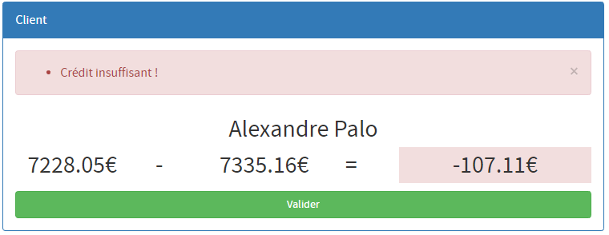
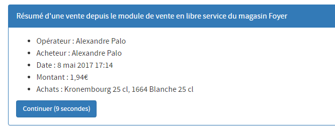

# Acheter des produits dans un magasin, libre service

## Introduction

### Différents magasins
Borgia utilise des magasins pour organiser l'ensemble des produits, des achats et des ventes au sein de l'association. Le nombre de magasin n'est pas fixe et peut évoluer en même temps que l'association. Par exemple, Siber'ss possède actuellement un Foy'ss, une Auberge et une C-Vis. Ce sont trois magasins qui permettent de vendre des produits aux membres de l'association.

Ces différents magasins sont gérès par des membres de l'association. La gestion fait l'objet d'une documentation spécifique et n'est pas détaillée ici. L'objectif de cette documentation est de décrire comment réussir à acheter des produits dans un magasin en libre service, sans l'aide d'un membre du magasin.

### Module de vente en libre service
Chaque magasin peut vendre des produits de deux façons :
  - Par un membre du groupe du magasin, c'est le cas de l'Auberge par exemple.
  - Directement par les utilisateurs, en libre service, c'est le cas du Foy'ss par exemple.

Mais Borgia se veut générique. Ainsi, il est possible d'avoir les deux types de vente pour chaque magasin ! Ainsi il est possible de vendre des produits en libre service au Foy'ss mais aussi de permettre aux Zifoy'ss de vendre des produits par eux même.
Pour séparer les deux types de ventes (par opérateur et en libre service), Borgia utilise des modules de vente et il y en a donc 2. Chaque module peut ou non être activé pour chaque magasin, en fonction de la volonté des membres du magasin.

Prenons l'exemple du Foy'ss. Si les membres du magasin active et configure le module de vente en libre service du Foy'ss, vous avez la possibilité d'acheter seul. C'est l'objet de cette documentation et nous allons voir ensemble comment le faire. Ne vous inquiétez pas, c'est semblable à ce que vous connaissez :).

## Achat de produits

### Accès aux différentes pages
L'ensemble des modules de vente en libre service activés sont listé dans le menu principal de l'interface Gadz. Dans l'exemple ci-dessous, le Foyer et l'Auberge possède un module de vente en libre service activé (pourquoi pas !).

En cliquant sur "Foyer", vous arrivez sur la page de commande en libre service :

### Navigation dans le module
#### Information de l'utilisateur
L'encart vert à gauche regroupe les informations de l'utilisateur, notamment son solde avant et après commande, ainsi que le total de la commande.

#### Récapitulatif de la commande
A droite, dans l'encart rouge, nous retrouvons l'ensemble des produits qui vont être achetés.

#### Produits
Enfin la partie principale de la page est consacrée à la sélection de produits. Chaque produit est regroupé dans une catégorie. Notons en plus "Emplacements" qui sera expliqué dans la partie suivante.

#### Navigation
Afin de se déplacer dans les différentes catégories il est bien sûr possible d'utiliser la souris et de cliquer sur les entêtes. Cependant il est souvent plus simple (en tout cas quand on veut aller rapidement et que la souris n'est pas forcément propre :p) d'utiliser le clavier.

Les touches flèches droite et gauche permettent de se déplacer dans les différentes catégories.

Chaque produit, dans chaque catégorie, possède un code de touche tout à gauche de la ligne du produit. Ici par exemple la touche du produit est "F1".

Si j'appuie sur "F1" au clavier, le produit sélectionné va être commandé (1 par 1).

>Remarque : Il n'y a que 12 touches "F". S'il y a plus que 12 produits dans la catégorie, il n'y aura pas de touche rapide affectée.

### Différents types de catégories
La première catégorie sera souvent "Emplacements". C'est une catégorie un peu spéciale qui regroupe les "emplacements de vente" du magasin.

Un emplacement de vente est un espace de vente identifié, unique à chaque magasin et qui regroupe des produits spécifiques. Dans le cas du Foy'ss par exemple nous avons 5 emplacements de vente : les 5 tireuses.

Des produits sont disponibles sur les emplacements, en fonction de ce que les membres du magasin indiquent à Borgia. S'il n'y a pas de produits, rien ne sera affiché sur la page de commande en libre service.

>Remarque : il est de même possible d'avoir deux fois le même produit à deux emplacements différents. Par exemple deux fûts de Kronembourg à deux tireuses différentes au Foy'ss. Essayez de commander au bon emplacement, afin de ne pas fausser la gestion des stocks de Borgia :).

### Finalisation de l'achat
Une fois que la commande est bonne il faut valider : soit en cliquant sur le bouton vert "Valider", soit en appuyant sur la touche entrée (centrale ou pavé numérique s'il existe).

Si toutes les conditions sont bonnes la commande sera finalisée. Si jamais vous essayez de commander un montant supérieur à ce que vous pouvez vous offrir, Borgia levera une erreur et la commande ne sera pas effective.

De même, il est possible que les membres du magasin aient définie un montant limite de commande.

### Résumé et redirection
Si tout est ok, l'utilisateur sera redirigé vers une page qui résumera la commande. Attention, la commande sera déjà effective à ce moment, l'affichage n'est qu'informatif.

Afin de quitter le résumé, il suffit de cliquer sur le bouton "Continuer". En fonction de ce qui est configuré par le magasin, vous serez redirigé vers la page de commande ou deconnecté. De même l'affichage du résumé peut être infini ou durée un certain temps avant que la redirection soit automatique (le temps restant est indiqué dans le bouton "Continuer").

Il reste ici par exemple 9 secondes avant la redirection automatique.

## FAQ
> Dernière mise à jour par Alexandre Palo, Past'ys 101-99Me214 le 08/05/2017 à 16h30.
